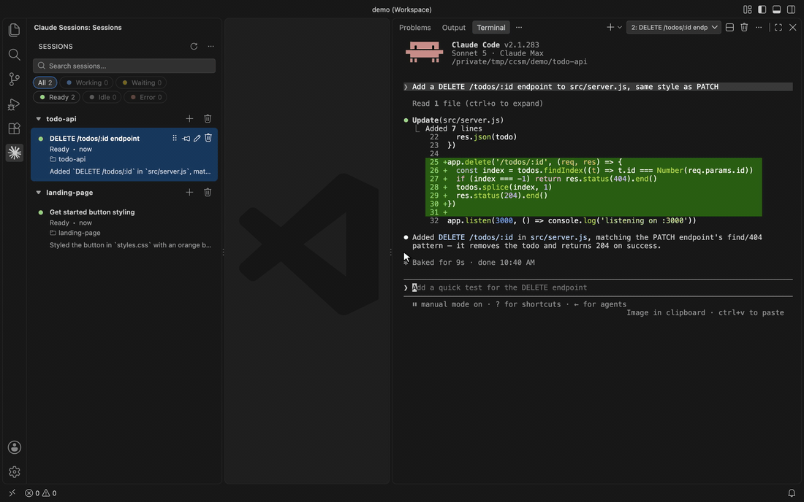
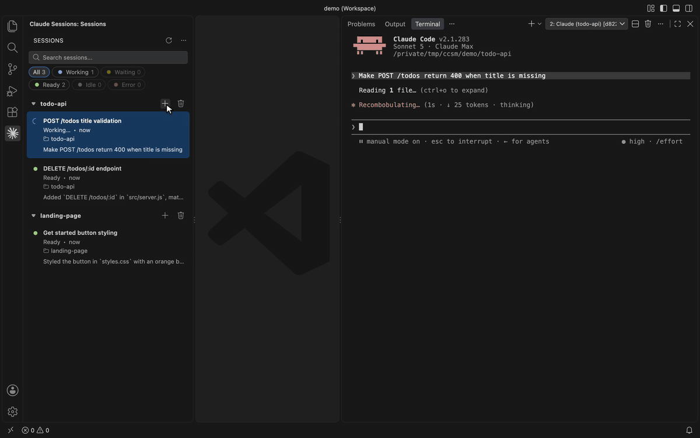
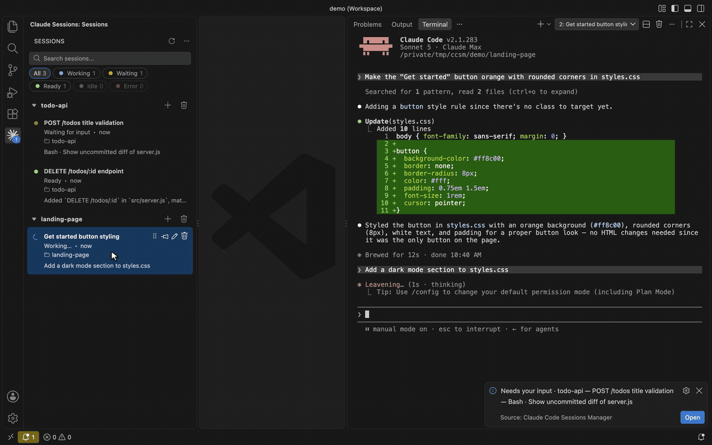
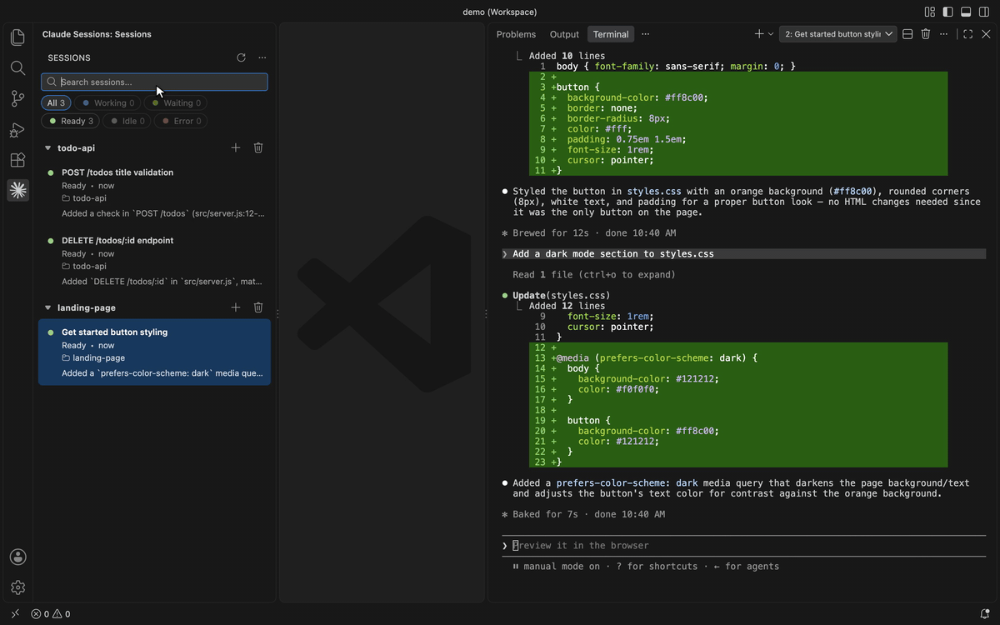
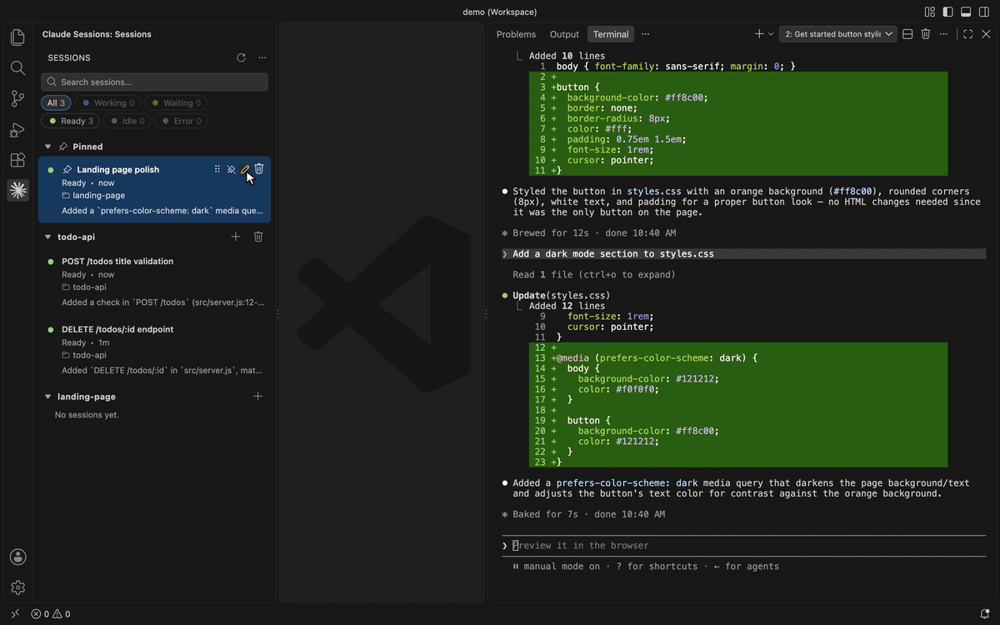

# Claude Code Sessions Manager

**Run many Claude Code sessions side by side — and always know which one needs you.**

A sidebar for VS Code that shows every Claude Code session in your workspace with its live
status, switches between them instantly in a single terminal, and taps you on the shoulder the
moment one is waiting on a permission prompt or a question.

> Formerly **Hero Code**. Existing installs update in place and keep their settings, pins and names.



## Why

Once you have more than one Claude Code session going, you're juggling terminal tabs,
re-reading scrollback to remember what each one was doing, and discovering ten minutes too
late that one of them has been sitting on a permission prompt. This extension turns those
sessions into one live dashboard next to your code.

## Features

### Every session, with a live status

Sessions are grouped by workspace folder and show what they're doing right now:
**Working**, **Waiting for input**, **Ready**, **Idle** (no live process) or **Error**,
along with the latest activity (`Edit · server.js`) and how long ago it happened. Status
comes straight from Claude Code's own session registry and transcripts, so it updates as
soon as Claude does. Filter by status or search by title to find a session in a long list.


### Switch sessions instantly, in one terminal

Click a row to open its session, or click **+** on a folder to start a new one. Sessions
run inside a private tmux server, so one terminal switches between all of them instantly and
the session you leave keeps working in the background. Your own `~/.tmux.conf` is never
loaded. Without tmux, each session gets its own integrated terminal. Resuming a finished
session runs `claude --resume` for you.



### Never miss a prompt

You get a notification when a session hits a permission prompt or asks a question, and
optionally when it finishes a turn or errors. While you're in VS Code it's an in-editor
notification with an **Open** button that jumps to the session. Once you've switched away,
it's a native macOS banner that clicks straight back into it. A badge on the activity-bar
icon and a status-bar item count the sessions waiting on you.



### Stay organized

**Pin** the sessions you care about to the top, **rename** them to something you'll
recognize, **drag** to reorder, and **delete** a session, or every session in a folder, when
you're done with it. Rows stay put through `/clear`: a cleared session keeps its row, pin
and name.



### Send code to the right session

Select code and press `alt+cmd+k` (`ctrl+alt+k` on Windows/Linux) to mention it
(`@src/server.js#L12-17`) in the session selected in the sidebar, not just whichever
terminal happens to have focus. With nothing selected, it mentions the whole file.



## Getting started

1. Install [Claude Code](https://claude.com/claude-code) and make sure `claude` runs in
   your terminal. Install `tmux` too (`brew install tmux`) for instant switching.
2. Install this extension and open the **Claude Sessions** view from the activity bar
   (`shift+cmd+c` / `ctrl+shift+c`).
3. Press **+** next to a folder to start a session, or click an existing one to open it.

Requires VS Code 1.90 or later.

## Settings

| Setting                                  | Default               | Description                                                                         |
| ---------------------------------------- | --------------------- | ----------------------------------------------------------------------------------- |
| `heroCode.terminalMultiplexer`           | `auto`                | `auto` hosts sessions in a private tmux server; `off` uses one terminal per session. |
| `heroCode.tmuxPath`                      | _(auto-detect)_       | Absolute path to `tmux`.                                                            |
| `heroCode.notifications.enabled`         | `true`                | Master switch for notifications.                                                    |
| `heroCode.notifications.onNeedsInput`    | `true`                | Notify when a session waits on a permission prompt or question.                     |
| `heroCode.notifications.onTurnFinished`  | `true`                | Notify when a session finishes a turn.                                              |
| `heroCode.notifications.onError`         | `true`                | Notify when a turn fails.                                                           |
| `heroCode.notifications.style`           | `auto`                | `auto`, `banner` (native macOS) or `toast` (in-editor).                             |
| `heroCode.notifications.whenFocused`     | `suppress-if-visible` | Whether to notify while VS Code is focused.                                         |
| `heroCode.notifications.sound`           | `false`               | Play a sound with native banners.                                                   |
| `heroCode.notifications.ignoreAutoMode`  | `true`                | In `auto` permission mode, don't treat a long-running tool as needing input.        |
| `heroCode.notifications.badge`           | `true`                | Badge on the activity-bar icon with the number of sessions waiting.                 |
| `heroCode.notifications.statusBar`       | `true`                | Status-bar item with the number of sessions waiting.                                |
| `heroCode.debugMode`                     | `false`               | Show launch id / live id / PID in a tooltip on each row.                            |

## Development

```bash
npm install
npm run compile      # bundle the extension + webview into dist/
```

Press **F5** in VS Code to launch an Extension Development Host with the extension loaded.

| Script                | Description                                    |
| --------------------- | ---------------------------------------------- |
| `npm run compile`     | Bundle the extension with esbuild.             |
| `npm run watch`       | Rebuild on change (used by the F5 build task). |
| `npm run package`     | Production (minified) bundle.                  |
| `npm run check-types` | Type-check with `tsc --noEmit`.                |
| `npm run lint`        | Lint `src` with ESLint.                        |
| `npm run demo`        | Re-record the README demo GIFs (macOS; uses real Claude turns). |

Package a `.vsix` with `npx vsce package`.

## Release notes

See [CHANGELOG.md](CHANGELOG.md).
